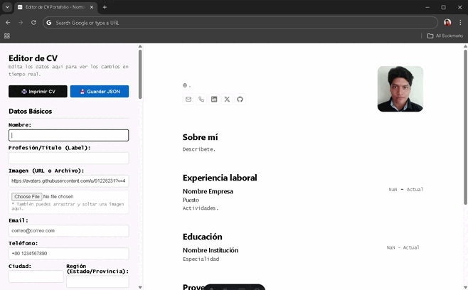

<div align="center">
 
<h2>
    <em>Résumé</em> minimalista maquetado para web y pdf
</h2>
<p>
Esquema del JSON de CV de <a href="https://jsonresume.org/schema/">jsonresume.org</a>
</p>


<p>
Basado en el diseño de <a href="https://github.com/BartoszJarocki/cv">Bartosz Jarocki</a>

</p>

</div>

<div align="center">
    <a href="#🚀-empezar">
        Empezar
    </a>
    <span>&nbsp;✦&nbsp;</span>
    <a href="#🧞-comandos">
        Comandos
    </a>
    <span>&nbsp;✦&nbsp;</span>
    <a href="#🔑-licencia">
        Licencia
    </a>
    <span>&nbsp;✦&nbsp;</span>
    <a href="https://midu.dev">
        Personal
    </a>
   
</div>

<p></p>

<div align="center">


</div>

</img>

## 🛠️ Stack

- [**Astro**](https://astro.build/) - El framework web de la nueva época.
- [**React**](https://reactjs.org/) - Biblioteca incorporada para la interactividad del CV Builder.
- [**Typescript**](https://www.typescriptlang.org/) - JavaScript con sintaxis de tipado.
- [**Ninja Keys**](https://github.com/ssleptsov/ninja-keys) - Menu desplegable con atajos de teclado hecho en puro Javascript.

## ✨ Nuevas Características Implementadas (Fork Actual)

Este repositorio incorpora mejoras sustanciales sobre el template original orientado a la interactividad y experiencia de usuario moderna:

- **CV Builder Interactivo (React):** Creador de CV en tiempo real integrado, que permite editar dinámicamente datos básicos (incluyendo Ciudad y Región), añadir nuevas secciones y expandir etiquetas de proyectos.
- **Iconografía Extendida:** Integración de una extensa nueva gama de logotipos incluyendo tecnologías de frontend, backend y herramientas de diseño (Astro, React, GSAP, Vue, Svelte, Angular, Python, Docker, Figma) y más redes sociales (Facebook, Instagram, YouTube).
- **Animaciones Premium (GSAP):** Implementación de animaciones avanzadas en la sección "Hero" utilizando los plugins ScrambleText y SplitType para lograr una entrada de texto profesional.
- **Experiencia Responsiva:** Solución a problemas nativos de *touch scroll* en los efectos de gravedad e implementación de ventanas modales fluidas que no se desbordan ni se recortan en dispositivos móviles.

## 🚀 Empezar

### 1. Clona e instala este proyecto


- Este proyecto usa [pnpm](https://pnpm.io/installation) como gestor de dependencias y empaquetador.

```bash
# Activa pnpm en MacOS, WSL & Linux:
corepack enable
corepack prepare pnpm@latest --activate

# Instala las dependencias del proyecto
pnpm install
```

### 2. Edita con el CV Builder o Añade tu contenido:
Edita el archivo `cv.json` directamente, o usa las nuevas características de nuestro **CV Builder** interactivo.

### 3. Lanza el servidor de desarrollo:

```bash
# Disfruta del resultado
pnpm dev
```

Abre [**http://localhost:4321**](http://localhost:4321/) en tu navegador para ver el resultado y acceder al editor 🚀.


## 🧞 Comandos

|     | Comando          | Acción                                        |
| :-- | :--------------- | :-------------------------------------------- |
| ⚙️  | `dev` o `start` | Lanza un servidor de desarrollo local en  `localhost:4321`.  |
| ⚙️  | `build`          | Comprueba posibles errores y hace un empaquetado de producción en `./dist/`.      |
| ⚙️  | `preview`        | Vista previa en local `localhost:4321` |


## 🔑 Licencia e Información

[MIT](LICENSE.txt) - Template original creado por [**midudev**](https://midu.dev) basado en el diseño de [**Bartosz Jarocki**](https://github.com/BartoszJarocki/cv). Adaptaciones y nuevas integraciones desarrolladas en este repositorio.
